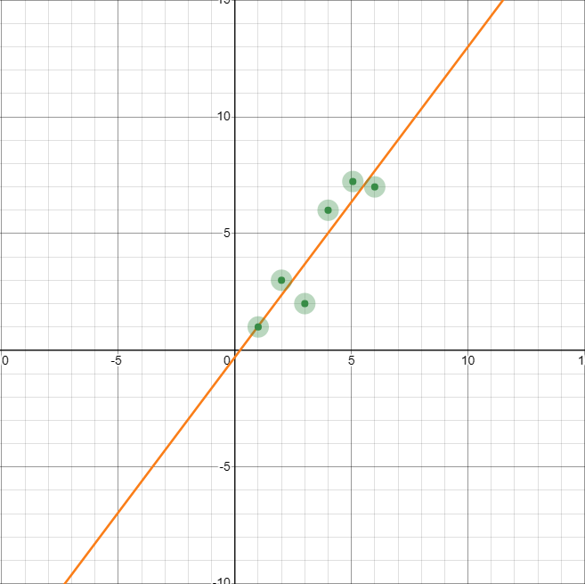

# Can Language Models Think?

> The Analytical Engine has no pretensions whatever to *originate* anything. It can do *whatever we know how to order it to perform*. It can follow analysis; but it has no power of anticipating any analytical relations or truths.
>
> -- Ada Lovelace, "Notes on the Analytical Engine" (1843)[1](#citation-01)

> I propose to consider the question, "Can machines think?" This should begin with definitions of the meaning of the terms "machine" and "think." The definitions might be framed so as to reflect so far as possible the normal use of the words, but this attitude is dangerous, [...]
>
> -- Alan Turing, "Computing Machinery and Intelligence" (1950)[2](#citation-02)

> As we discuss in §5, LMs are not performing natural language understanding (NLU), and only have success in tasks that can be approached by manipulating linguistic form [...]
>
> [...]
>
> [...] no actual language understanding is taking place in
LM-driven approaches to these tasks [...] Furthermore, as Bender and Koller [14]
argue from a theoretical perspective, languages are systems of
signs [37], i.e. pairings of form and meaning. But the training data
for LMs is only form; they do not have access to meaning. Therefore,
claims about model abilities must be carefully characterized.
>
> -- Emily M. Bender, Timnit Gebru, Angelina McMillan-Major, and Shmargaret Shmitchell, "On the Dangers of Stochastic Parrots: Can Language Models Be Too Big? 🦜" (2021) [3](#citation-03)

(We endeavor to mark any technical vocabulary which it is not necessary for the reader to care about with an asterisk: \*)

## 1. The Question

Can language models think?

We should define these terms. For our purposes, a "language model" is some computer program, running on real hardware, which produces text as its output. As of this writing, such a model is probably a descendant of the Transformer\* architecture (Vaswani et al, 2017)[4](#citation-04). This architecture and the techniques surrounding it (gradient descent\*, cross-entropy loss\*, et cetera) are very important for recent research in the field, but the only essential characteristic of a "language model" is that it produces text as its output. We will start with this general definition, and then work our way towards the specifics of the types of models that exist today.

What does it mean for a language model to think? Any normal use of the word "think" does not seem like it will work here. Ultimately, what we mean when we say "think" is "able to do the sorts of things that humans do". This insight is, of course, originally from Alan Turing. There is a specific test, the "Turing test", that he proposes. This test directly measures the computer program (which he calls a "machine") against a human, such that we judge a program to certainly be thinking if and only if the text the program outputs can pass for human.

This is a very neat solution to the problem. If we accept that humans think, and that human thought can be expressed fully in written text, then anything which cannot be discerned from a human in written text must also be thinking.

## 2. The Turing Test

We will take as given that humans think. We may not want to take for granted that human thought can be expressed fully in written text. Much of what humans are able to do does not involve language at all, much less written text.

To rephrase the assertion: to master human language as well as a human does suffices to demonstrate human equivalent thinking. Seemingly the simplest and most direct argument for this is that nothing humans ever do is categorically more complex than language. There are an astronomical number of possible things to say, and choosing one of them as well as a human does simply cannot be done without being at least equal to a human.

Considering the cases of humans with various disabilities should also convince us that writing alone can express the presence of human thought. We do not doubt that people who are blind and deaf from birth experience thought because they are not able to speak or to write with conventional implements. Any of us can be paralyzed completely by injury. In cases, people have been limited to expressing themselves by well timed blinks to dictate writing. Such writings do not fail to express human thought. On the contrary, the sheer labor involved in such a thing seems almost guaranteed to mean that far more thought goes into every detail.

There are many human endeavors besides writing. Thought and care are expressed and understood in music, and movement, and all the arts we see with our eyes. Being able to write convincingly, such that no reader could ever tell that the author was not human, does not guarantee that a program is able to think in all the ways that humans think. This is also true of those who are born totally colorblind, and who seem unlikely to be able to imagine color, and true in other ways of other disabilities. It is obvious to us when the subject is human that these sorts of disabilities do not rob the person of their humanity, of their ability to think in the way that makes them human. It would require special pleading to deny the same grace to a program.

Turing's test, as originally proposed, is not perfect. In brief: An interrogator exchanges messages, entirely in text, with another human respondent and a computer program, which they know only as A and B. Eventually, the interrogator has to choose which of A or B is a computer, and which is a human. Turing does not specify many peripheral details of administering the test, such as who the humans involved are. Many purported "Turing Tests" have been devised and administered since the test was first proposed. As a general rule, they are executed in some manner that gives the program some advantage, such that some plausible research project then existing has some chance of claiming to have made progress against the test. In cases where the test does not advantage the program, the program, of course, performs poorly.

## 3. A Stricter Turing Test

We prefer to contemplate a test that is delivered under circumstances that disadvantage the program as much as possible. We need some reasonable population of interrogators and respondents, and we consider a program to pass this test only if no method of choosing or preparing human interrogators and respondents for the test, including allowing them to perform the test many times, allows them to discern each other from the program more than 50% of the time. This would have to apply to interrogators, respondents, and to pairs thereof. Passing information outside of the text-only test environment is the only prohibition, and for any interrogator and respondent that perform multiple sessions, their past mutual history should be available both to them and to the program. Any program passing such a test would be producing text which was indistinguishable from that produced by a human, and therefore able to think as well as humans do. When choosing its next message, the program would be performing an operation at least as complex as the one the human performed.

No program currently existing passes this very strict test. Unfortunately, most humans would not pass this test either. Some people are certainly more skilled at convincing the interrogator that they are human than others, and those humans that are less skilled at this would not be judged to be "thinking" by the criteria of the test if they were entered in the program's position. In order to pass this test, a program does not have to be better than most humans or a median human at seeming human. Instead, it has to seem at least as human as the most human-seeming human available.

If we accept that humans at large do think, we would like to relax this test somewhat to include them. We will continue to assume that we are comparing only trials of the Turing test where the interrogator is the most skilled, such that in many tests between many interrogators and many human respondents, we measure only how successful the best interrogators are at discerning humans from programs. We will require of the human respondents only that they be drawn from some reasonably sized population more or less at random, and that they sincerely be attempting to convince the interrogator that they are human during each trial. We would have to concede that a computer program was thinking as well as a human if its percentile was at least 50% considering the best-performing interrogators. If the program had any notable shortcoming relative to most humans, the interrogators could exploit that and its percentile would be far below 50%.

## 4. Old Objections

We will take for granted that there is some program which could possibly be constructed which would pass such a test. Turing's paper on the test itself helpfully addresses most of the plausible-seeming objections to the notion that some program could, in principle, think.

Many of the objections Turing covers to the notion that a program could think are still commonly used. In many cases the modern strain of the objection adds some new detail. Any of these objections, if valid, would apply just as well to the models we actually have as it would to the general concept of a program. It will be useful to go over these objections briefly.

The first, Turing calls "The Theological Objection", and it is the assertion that humans have souls and machines cannot have souls. Modern constructions asserting that all humans have something that machines cannot have, such as 'qualia', all uniformly restate this with the choice of word changed. Disentangling all such arguments is beyond the scope of this document; the reader is invited to return when such objections no longer seem reasonable to them.

The Mathematical Objection and The Argument from Consciousness, which Turing covers, also follow this pattern. In this case, the things that humans have and machines cannot have are "mathematical completeness and consistency" and "consciousness". One of the related modern constructions asserts that human consciousness is somehow quantum mechanical. The only evidence offered for this seems to be that quantum mechanics is very mysterious.

The Arguments from Various Disabilities is the objection from the paper which seems to be the most common currently, and Turing's text deserves to be exerpted here:

> These arguments take the form, "I grant you that you can make machines do all the things
you have mentioned but you will never be able to make one to do X." Numerous features
X are suggested in this connexion. I offer a selection:
Be kind, resourceful, beautiful, friendly, have initiative, have a sense of humour, tell right
from wrong, make mistakes, fall in love, enjoy strawberries and cream, make some one
fall in love with it, learn from experience, use words properly, be the subject of its own
thought, have as much diversity of behaviour as a man, do something really new.

This passage has aged very nicely. It is especially amusing to see "make mistakes" on the list. Most of the time when we see the Arguments from Various Disabilities made now, they concern some current category of common mistakes from LLMs. (To wit: They are bad at arithmetic, they rhyme poorly, they cannot count letters well, they are prone to odd spelling errors, they repeat themselves, they have no long term memory, they are often poor conversationalists, and they confabulate completely made up facts with complete abandon.)

Turing's remarks state, it seems correctly, that all such assertions are made out of induction, that is, because people have never seen such a thing happen, they think it is natural that it never could. This reasoning is categorically incorrect. It was incorrect in 1950 when Turing was stating that it was used to argue that no program could use words properly, and it is incorrect now.

To abuse induction the other way: Since Turing wrote in 1950, many such arguments regarding various disabilities have been made and proven wrong. Chess and Go were popular objections of this kind. Natural language comprehension was another, and Turing cites it directly. Turing had to die and half a century had to pass before he was definitively proven right about computer programs being able to use words properly. We have no idea how long it will be before any given argument is proven wrong, but it would not seem wise, given past progress, to assume that the trend will reverse itself.

Simply to be contrary: If cutting edge language models are still notably bad at math, rhyming, counting letters and spelling, and it is the year 2034 or later, I should be mocked as thoroughly as possible for my naivete here.

We note that we are passing over Lady Lovelace's Objection here. We do this not because it is less interesting than the others, but because it is the most interesting objection and the most modern. Alan Turing could not possibly have anticipated the types of things we say concerning it now. This objection deserves its own discussion, and benefits immensely from a modern context.

The objection is this:

> The Analytical Engine has no pretensions whatever to *originate* anything. It can do *whatever we know how to order it to perform*. It can follow analysis; but it has no power of anticipating any analytical relations or truths.

This very modern and subtle argument was written in 1843.

After the arguments from various disabilities, this is the argument that is the most commonly repeated today. Saying that a language model is a "stochastic parrot" or saying they "only have success in tasks that can be approached by manipulating linguistic form" are simply ways of restating it. Sometimes, these arguments are made cautiously. When made cautiously, these statements state that some category of language model, X, cannot be original, but that perhaps some other category of language models, Y, might. More often, there is no Y, and the statement is only that the types of models we actually use cannot be original. Frequently, these types of arguments have no qualifiers and seem to state that no program can ever be original.

The core dispute about whether modern language models can think is, fundamentally, whether we think Ada was right about this in general or whether this applies specifically to the models we have now. I would answer no to both. It is enduringly impressive that she managed to ask the question at all nearly two centuries early.

## 5. New Objections

Before we return to Lady Lovelace's objection, we will go over objections to current-generation systems that could not have been proposed in the 1800s. Many of these have similar flavors to those that Turing covered. Turing put Lady Lovelace's objection late in his paper, and it would seem he did so wisely. Before you address such an objection directly, it is better to address the many similar objections that often are often hidden in it.

### The Argument from Unimpressive Components

This model is "only" "X", therefore neither it nor anything like it can think (or demonstrate any other property I do not think X can have).

X is variously: Math, matrices\*, statistics, electricity, training data. I am sure there are many more.

We can also make this argument against people, where X can be: atoms, chemicals, electricity, molecules, carbon compounds, enzymes, burning sugars, electricity, random mutations.

Human beings are "just" apes retrofitted with some extra fatty tissue loaded with ion pumps. We call this "brain matter". Each individual part is perhaps unimpressive, or can at least be described so it sounds unimpressive. In aggregate, they are a person.

Complex things can have many simple parts. In fact: It is difficult to think of any complex thing that does not have many simple parts. One sound is noise, but many sounds can be music. Visual art is just lines, or brushstrokes. Books are just letters.

Anything can be made to sound trivial if it is described as "just" what it is made of. Everything is made of something, and whatever it is made of will generally be some reasonable number of reasonably simple things.

This argument is bad. People should not be persuaded by it. People will continue to be persuaded by it because it is good rhetoric. X, whatever X is, is unimpressive or boring. Therefore, anything made of X must also be unimpressive or boring.

If we want to be correct, we should avoid falling for such arguments. We have many counterexamples, so we know that they are not always true.

### Argument from Architecture

Some category of program, X, can never do X. Therefore, it cannot think. (Possibly we mean to imply that no model of any kind can think).

In some limited cases this is true. A single layer neural network* cannot compute the XOR\* function, for one famous example. Certainly, human thought is at least as complex as XOR, so anything which cannot compute XOR cannot think. This is a good argument against a single-layer neural network being able to think.

Generally speaking this is untrue of any broad category of architectures still in use in 2024, the most common of which is the transformer. They are Turing-complete\*, or as close to Turing-complete as anything which has finite memory can be. (For any unfamiliar: This means that it can perform any computation.) There are a few theoretical arguments pertaining to the complexities of the circuits they can learn, but most of them do not seem to make them less general than a human being, which also have only a finite ability to deal with complexity.

It is very difficult to be sure, given that current architectures are turing-complete and that they are often modified in many ways, that they categorically cannot do any particular thing. It is plausible that no current version of a transformer can do some specific thing efficiently enough to make doing that thing feasible on any hardware we can make. However, architectures are varied upon constantly. Our efficiency at completing the same task has increased many times over in recent years. To state that a given architecture, exactly as it currently exists, cannot do any particular thing efficiently is not an argument not to use that architecture at all. It is an argument to modify it, as we can and have done many times.

As we generalize the approach: Either some architecture can think, or no architecture can. If some architecture can think, any specific disability you can find in a current architecture will give you a hint about what must be true of an architecture that could think.

Generally speaking, the principle of "stacking an arbitrary number of matrices\* in some clever way" has consistently proven that it solves any problem we can find a way to use it on. It is a general method of solving problems for which a solution is difficult to write out precisely, the same way writing is a general method of conveying meaning and computer programs are general purpose methods of doing well-defined math. Arguing against a specific architecture is either arguing in favor of some alternative architecture or failing to consider that alternatives could exist.

### Argument from Training Modality

From our opening, we know the argument that "languages are systems of signs [37], i.e. pairings of form and meaning. But the training data for LMs is only form; they do not have access to meaning."

This was not even true when that paper was published. Models already existed (e.g. CLIP (Radford et al., 2021)[5](#citation-05), and much earlier, YOLO (Redmon et al., 2015)[6](#citation-06)) which directly paired signs (words or sentences) with their meanings (pictures of objects). Image generation already existed as a field, where the generation task is always to pair sign (the prompt) to meaning (the output image). We currently have models which mix audio, video and text freely in input and output. They are still, compared to pure text models, a work in progress, but it is not really disputed whether they work at all. As a general rule, they do.

You could claim that a model that could identify you from a picture did not know the "meaning" of who you were, but then you would have to claim the same thing of another person who recognized you in a picture. What is the person doing, in identifying you, that the model is not?

The answer is nothing: the task of recognition is the same. We can claim that "meaning" is somehow impossible to put into any form whatsoever, that digital data coming from video cameras and microphones is somehow "less meaningful" than the sense inputs of our eyes and ears. This seems like a way of smuggling in the Theological Objection again: that when a person does something it is imbued with a soul, or with meaning, but when a program does the same task it is not. Data in a computer is "just" electricity, but our thoughts are made of electricity too. If we assume that humans are special and distinguished, and only human acts can have "meaning", then of course programs cannot think, but the argument is circular.

We can also restate this as an argument from disability: if a human had some disability (sight, hearing) but still had language, we would not say that they did not understand meaning.

We can narrowly give the argument this: It is possible that some tasks are prohibitively difficult to learn from scratch without certain types of data. Humans with disabilities still have human brains, and human brains were formed under the requirements imposed on them by all the senses that humans typically have. If we were all deaf as a species, it seems plausible that we would not have developed language. In the opposite direction, models trained to produce audio of human speech, but not given any text to help them learn what words are, typically produce a babble of disconnected syllables and voice sounds. The same model, when given text to learn from along with audio of someone speaking the words, can learn to produce speech from written text. For many years, and possibly still today, the first such well-known model was the voice of the Google Assistant, which comes built into every Android phone. (van den Oord et al., 2016)[7](#citation-07)

This is not an argument against models in general being able to think, or understand language. At most, this applies strictly to models with only written text as training data. Even there it is empirically questionable. We know that models trained strictly on language data can sometimes produce mostly reasonable answers to questions about the physical world, such as: "Here we have a book, 9 eggs, a laptop, a bottle and a nail. Please tell me how to stack them onto each other in a stable manner." (Bubeck et al., 2023)[8](#citation-08)

Text is rich with meaning. As humans, we are always trying to find new ways to condense our thoughts, to condense meaning, into words. Training a language model is the task of extracting as much meaning from that text as possible. It is possible that some things cannot be learned, or learned well, or learned efficiently, only from text. It is nevertheless strange to assert that the text itself has no meaning. Of course it has meaning. It is perhaps the densest form of human meaning, where a person can put the residue of a lifetime of thoughts and feelings into less space than a phone background.

### Lady Lovelace's Original Objection

To shorten it: "Programs cannot be original".

We have simple examples which contradict this, and which it would have been difficult to anticipate at the time.

Although the program a computer is running is simple, the result can be more complex than its maker could have anticipated. If whoever programmed the computer did not know the result in advance, the computer has, in fact, "originated" something. To exclude random outputs we have to add another rule: To be meaningfully original, we will also require that the output be something that a human would have needed to use at least some effort to produce in similar circumstances.

We see this with game playing easily. Programs for chess and go beat the people who made them. Because these games are well-documented, we know that the moves the program chooses are often original. No human has ever made that specific move before, and the move is better than any human would have chosen.

This is the difference between memorizing data and generalizing. Let us use a visual aid. Unfortunately, there will be math.

This line fits these data points, more or less. If you had a program that simply output all of the points, it would be memorizing. If your program takes the points as input and generates the line as output, it generalizes. (The curious may note that the line does not fit the points exactly. This is because we ordinarily expect input data to have random noise in it.)

Game playing programs generalize. They play moves, and games, which are very good and which no human has ever played. The input data does not contain the things that the program outputs. Humans cannot predict what these programs do, and the only programs likely to predict what a good game playing program does are comparably good game playing programs.

This is not even controversial, and it feels somewhat silly to say at all, much less to say it many ways.

It is fair to object that games are by their nature small, and perhaps what we consider "original" is too broad to be captured by them. This is a fair objection. It is worth noting: This was not commonly said before computers became much better than humans at these games. Once upon a time, it was not uncommon to hear it said that only a truly sentient being could play chess well. We know now that this is not true.

Lady Lovelace also states that a program cannot anticipate analytic relations or truths (ie, do mathematical proofs). As it happens computers often do this now, although there is no way Ada could not have known that this would happen. At most we can say that computers are only pretty good, and not excellent, at doing mathematical proofs now. I do not fear that it will age poorly if I say that by the time I am old, I expect mathematical proofs, like chess, to be something that everyone just accepts computers are better at than humans.

### Lady Lovelace's Objection, Revisited

#### Weak originality

We turn back, now, to our primary question: Can language models think? Or in the words of the objection: Are they original?

This objection still seems to have some weight in the current year. Language models are called "stochastic parrots", "blurry jpegs", "glorified autocomplete" or "plagiarism machines". We can admit that these terms are good rhetoric. Parrots, jpegs, autocomplete and plagiarism are all unimpressive. Comparing anything to them is a good way to convince people that it is unimpressive, too. We will do our best to ignore this, and to consider only whether or not language models and other programs in the current research paradigm are original.

First let us test for a sort of weak originality: If I give you two random words, and ask you to use them both as many times as possible in a short story, surely you cannot do this without telling a story that has never been told before, nor could you do it if you did not understand the words you were given and the English language. It is possible your first story would be very obvious, and someone may have told a similar one once. To make sure what we are asking for is something new, we could require you to tell more than one such story, with each not resembling the last one.

If I asked a human to do this, and they did it successfully, I would be convinced that they spoke English, understood both words, and could write things nobody else had ever written before. If I said they were "unoriginal", what I would actually mean is that their story was bad. Perhaps it is unoriginal in the sense that it is similar to other stories in some abstract way. All of the sentences can be original, but the story can still be "flat" and not explore anything in any way that does not seem cliche. We will call that sort of originality "strong originality", and we will postpone dealing with it until somewhat later.

For this test, we draw from [eff_large.wordlist](https://github.com/keepassxreboot/keepassxc/blob/afe634d4f2a0f32e96ea720289262a4be90afc0f/share/wordlists/eff_large.wordlist), a list of 7776 random words that is used for password generation. We draw 'morally' and 'tactics', which feels too easy somehow. Random outputs often feel disturbingly non-random. I apologize for this. We include the generated text [elsewhere](media/01-can-language-models-think/Crafting%20Moral%20Tactics.md) to avoid cluttering this document. Several rounds of dialogue were necessary to try to avoid anything that felt like a cliche, and therefore guaranteed to be "unoriginal". Dialogue ended when the author became bored, and felt like the point was made.

In general, the language model demonstrates amply that it understands English, knows the meanings of the words 'morally' and 'tactics' quite well, and can use both together in a way that is consistent with their meanings. When troubled to avoid cliches, it produces stories with progressively more ridiculous and unlikely premises and makes a reasonable effort to coherently elaborate upon those premises, using its assigned words and subjects in surprising but intelligent ways. It seems guaranteed that the total output is both good English, and original, in the sense of never having appeared anywhere before.

We will note that the phrase "The Rhythmic Moralist" appears to not exist anywhere on the Internet as of this date. This will no longer be true when the above-linked file is indexed, making this almost certainly an original use of that specific phrase. (I am sorry.) Looking for "morality", "tax code" and "interpretive dance" produces few results, most of them very long written pieces or transcripts which seem to have mentioned them all in the course of a large amount of text(Wheaton, 2005)[9](#citation-09), but never all of them together. We can safely assume that the premise for the story is original, if bad.

We can state fairly definitively that language models are sometimes original with language in the same sense that reasonable but not superhuman chess-playing programs, or good human chess players, are sometimes original at making good chess moves. The experiment is pretty trivial, and seems somewhat ridiculous to have run at all. There are many other ways of demonstrating that language models are original in this way. This is just the first one that came to mind.

If we had any serious doubt that we would get a similar result for any two words with the same nudging, we could do this in a loop and have a boundless supply of stories. We could check if these stories coherently used language to elaborate on their subject matter, and go looking to see if their titles and premises had ever appeared anywhere else. This would not be a good use of anyone's time, because we already know how it will turn out.

Language models generalize: they understand English (or their language of origin) as well as or better than an average native speaker for most purposes. They understand common and uncommon words, phrases and concepts and they can put together sentences and stories and ideas that have never existed before from them. We can say weakly that language models are original: they write things a human would have to think about, and that are not repetitions of anything that has ever been written before. They do this millions of times a day, every day.

A certain researcher stated that his personal test was whether or not language models understood his jokes, and now they do. (He seems somewhat worried, therefore, that AI might kill us all. We will save this question for a later document.) Anyone who had such a litmus test, which boiled down to the model understanding English, has probably seen it passed recently by contemporary models. If they haven't, they will soon. (Knight, 2023)[10](#citation-10)

We seem to have very quickly forgotten this, but once upon a time it would have been common to say that this would mean that we had solved AI as a whole, and that such a program would surely be as smart as a human in every way. Much like chess, this has turned out to not be true. Language models understand language, but they have various serious disabilities and in some ways are clearly not as smart as humans.

In humans, nevertheless, we would certainly call what they are doing thinking. If you watched a student write out any of the things a language model can write, it would be bizarre to say that they were just repeating things from their past, like a parrot. Parrots cannot tell original stories, even bad ones. You could accuse the student of plagiarism but you would never find what they were copying from because they aren't copying.

And yet: We are anchored, in humans, by the knowledge of what human thought is like in its full complexity. We fill in the blanks, and infer from the story that there is a complete human mind, capable of complete human thought behind it. Our language models do not seem to have one of those yet. If we infer that they do from the fact that they are as capable as humans in some way, we will make many serious mistakes. For example, we might assume that they will not make things up, or will tell us truthfully if they wrote something that we suspect is plagiarized.

Whether language models think, then, depends on where you set the bar. If we wanted to be sure that a language model could think as well as a human, you would have to be sure that it could do all of the things that humans could do. They cannot yet do this. Passing that test is sufficient to say that the model thinks, but it is not necessary. Something could be thinking, and could still fail the test. Many humans would likely fail the test, if their language skills were poor. If we have to place the program at the 50th percentile to pass it, fully half of humans would have to fail the test. Any other percentile mark simply decreases the proportion of such humans, but does not remove them. Those humans are, generally, still thinking as we would ordinarily understand the meaning of it. If we want to honestly answer if something can think, we can only answer "yes" with certainty if it can pass for human in all cases, but we might admit that it has some similarity to a human if it passes in some cases.

Thought exists on a spectrum. You can often see that humans who cannot use language at all are still thinking. Because we are human too, their actions often show us their thoughts. We are more or less certain that other people think even if they are not very good at convincing you of who they are in writing.

I would argue that current language models do think to some degree, but they do not think as humans do. Neither the development of any specific language model nor the line of research as a whole follows human lines. They do not follow human history for any specific human, nor for humanity as a whole. We cannot expect them to parallel humans in what they can and cannot do. They do not parallel humans who have specific disabilities, either. Although they can think in the sense of "use language intelligently", they do not have coherent personalities or motivations and they do not really seem like they are beings to us. They are computer programs that have had more or less the entire internet compressed into them. This results in something that seems more like a bit of subconscious or stray brain matter than a human being.

Why does this distinction matter?

If you set your expectations of current models, or those to come, based on whether or not they "think" at all, and believe they absolutely don't or absolutely can't, you will probably be wrong. Such predictions have generally been wrong in the past. If you find all these arguments unpersuasive, you are welcome to write down a series of things that nothing like a current language model can do, because it will have to be able to "think" first, and it doesn't now. We call such lists "benchmarks", and we find them very useful. We keep having to throw them out and make new ones because language models are improving too quickly.

If you set your expectations of current models by assuming they do think, but that they are strange, inhuman, and very bad at many specific things, you will probably have a better track record going forward. You would certainly have had a better track record than majority opinion if you'd held this opinion since about 2020.

#### Strong originality

We had to admit, in setting this criteria, that we sometimes mean something stronger than this when we ask if a program can be "original". We sometimes mean, essentially, that we will not accept that programs can be "original" until they can be original in all the same ways humans can be. Our current models do not meet this bar. Certainly a program that could pass a strictly-administered Turing test would. This raises the question: What separates such programs from each other?

There is a related objection which has, I think, some validity. Currently, language models are trained to simply guess the next "token", where a token is a few letters or words or sometimes a piece of punctuation. This objective causes them to be prone to memorizing, rather than generalizing. For example, most good language models currently have many hundreds or thousands of digits of pi memorized.(@fluffykittnmeow, 2023)[11](#citation-11) This tendency to memorize is usually used to argue that language models cannot generalize at all, which isn't true. We know that they do. It has been argued, in our opinion persuasively, that the current generation of language models are, nevertheless, very hampered in generalizing by this objective.(LeCun, 2024)[12](#citation-12)

What does it mean to generalize, but not as far as we would like? For this, we turn back to the difference between memorizing and generalizing. We can draw a further distinction between interpolating, and extrapolating.

Let us check the graph again:

This line is correct for points that we can see. If there were more points, which we had never measured, further to the right or the left or the top or the bottom, the line might be completely incorrect. For points that are close to the points we have measured, we are interpolating; for those that are far away, we are extrapolating. We can draw more than one type of line through these points; some of them will extrapolate correctly, and others badly, depending on where all the points we have not sees turn out to be. An illustration with an obviously curved function shows us what can happen when a model is too simple for the data it fits, where the red line is the model and the blue line is the data.

(Wolfram, 2024)[13](#citation-13)

The example is contrived, and the subject area covered in more detail in most textbooks on statistics. In case it seems unrealistic that this would apply to the models we actually use today: it isn't, really. Fundamentally, some of what we are having our models do is "out of distribution": it is something that is very different from its input data. We can fit more than one model on the input data, and the models will tend to fit the data well and be the same as each other as long as they are close to the data, but they may be totally dissimilar from each other and the data further out.

"Weak originality" is interpolating successfully. We argue that models currently do interpolate reasonably well.

There are two possibilities when it comes to "strong originality".

One is that better interpolation on current data would be more "original". Language model input data typically includes, for example, every book ever written. It seems possible that if a model truly understood every book ever written, and extracted every possible bit of information from them, it would have to be at least as original as the authors of those books were when writing them. We have, to date, made our language models smarter by simply scaling them up, and especially by scaling up how much data we give them. If we were more efficient at extracting useful information from that data, and especially if we could repeat data more, we might achieve substantially smarter models than we have now. To do this, it might be necessary to adopt some objective other than guessing the next token one at a time. This would more closely resemble the way we currently train image models, where being able to gather trillions of examples of data and repeat each exactly once is not feasible due to the size of image files. Several lines of research have attempted variations to the language model training objective of this kind.

Our other possibility is that "strong originality" requires extrapolating successfully. It can be argued, we think persuasively, that current models in the year 2024 fail to do this much currently. It is possible that when we seek "true" originality, originality that feels human, we need the model to be able to consistently explore outside of any path that any human has already carved in anything yet written. It also seems likely that a research paradigm that achieved this would achieve *much more* than just making a model seem, finally, "creative" when it wrote essays.

Unlike chess-playing programs, language models are not yet better than all humans at everything within their domain. Language is a much larger domain than chess, and surpassing human mastery of all the uses of language is much more of an endeavor than surpassing human mastery of chess. Language models are currently "original" in the same sense that a reasonably good, but not great, chess program might sometimes do original things. They are not original the way that a great player would be said to be original. If we make a model that often seems "original" the way a clever human seems original, we will most likely have to make something that generally seems much more clever than most humans. This would follow the trajectory of models for playing games, which went from vastly inferior to vastly superior to humans in very little time.

How did game playing models achieve this? Primarily by playing games against themselves. This allows you to simply use up more computer time instead of gathering and curating data. Moves played by a good game-playing program can seem very original to us, but may not be to the program itself. It is quite likely that, from the program's perspective, the exact move it is playing is one it has played thousands or millions of times. Because games are a relatively small domain, with a clear criteria for winning or losing, it is now reasonably well understood how to implement self-play with monte carlo tree search* to train programs to play games. Various research projects have tried to find ways to apply this paradigm to language modelling. So far, none of them has become a compelling choice for being the best method of training a language model.

We are lead to a strange conclusion.

Most of the *particular* objections commonly raised, currently, to the notion that modern language models are "original", or can or could "think", seem to be incorrect. They are generally wrong in their particulars, and they follow the same patterns as many seemingly persuasive and wrong arguments in the past against, e.g., good computer chess programs. Much of what language models currently do meets the minimum bar of things which we would feel *certain* indicated some level of thinking or originality in a human being. We call this "weak originality", and it is commonly and incorrectly argued that language models do not have it or that some of their relatively minor disabilities mean they cannot have it.

Ignoring particular objections, however, it does seem true, given their limitations, that language models are still some distance from being able to "think" or "be original" if what we mean is "think and be original as much as a human being can be". When phrased this way it is obvious that the criticism is true, and also obvious that anything which overcame the criticism would be a rather imposing technology.

This makes it clear that most such lines of criticism impose sort of a false dichotomy: advancements in AI can be depicted as unimpressive in this way until the moment when they surpass humans. We have seen it happen this way in the past, and it seems likely that if we simply follow the zeitgeist we will be surprised in this same way by each new development in the technology. If we remember the past and take the arguments made today seriously, we can avoid repeating this history.

And last: The objections to the "originality" or "reasoning" of language models that still seem plausible under scrutiny relate to the way we train modern language models, and not anything else. It is untrue to state that language cannot reason or be original *at all* due to this. It is absolutely true that the methods we use for training language models often encourage learning things that we would not consider conducive to reasoning or originality (eg, memorizing digits of pi). This, particularly, seems to point us towards which lines of research we can expect to deliver the greatest breakthroughs in our near future.

## Citations

<a id="citation-01">1.</a> Lovelace, Ada. "Notes on the Analytical Engine." In Scientific Memoirs, edited by Richard Taylor, 3:691-731. London: Richard and John E. Taylor, 1843.

<a id="citation-02">2.</a> Turing, Alan M. "Computing Machinery and Intelligence." Mind 59, no. 236 (1950): 433-460.

<a id="citation-03">3.</a> Bender, Emily M., Timnit Gebru, Angelina McMillan-Major, and Shmargaret Shmitchell. "On the Dangers of Stochastic Parrots: Can Language Models Be Too Big? 🦜" Proceedings of the 2021 ACM Conference on Fairness, Accountability, and Transparency (2021): 610-623.

<a id="citation-04">4.</a> Vaswani, et al. "Attention Is All You Need." arXiv preprint arXiv:1706.03762 (2017).

<a id="citation-05">5.</a> Radford, et al. "Learning Transferable Visual Models From Natural Language Supervision." arXiv preprint arXiv:2103.00020 (2021).

<a id="citation-06">6.</a> Redmon, et al. "You Only Look Once: Unified, Real-Time Object Detection." arXiv preprint arXiv:1506.02640 (2015).

<a id="citation-07">7.</a> van den Oord, et al. "WaveNet: A Generative Model for Raw Audio." arXiv preprint arXiv:1609.03499 (2016).

<a id="citation-08">8.</a> Bubeck, et al. "Sparks of Artificial General Intelligence: Early experiments with GPT-4." arXiv preprint arXiv:2303.12712 (2023).

<a id="citation-09">9.</a> Wheaton, Wil. "December 2005." WIL WHEATON dot NET, December 2005. https://wilwheaton.net/2005/12/.

<a id="citation-10">10.</a> Knight, Will. "What Really Made Geoffrey Hinton Into an AI Doomer." Wired, 2023. https://www.wired.com/story/geoffrey-hinton-ai-chatgpt-dangers/.

<a id="citation-11">11.</a> @fluffykittnmeow. "Posted: Last edited7:03 PM · Dec 20, 2023." X, December 20, 2023. https://x.com/fluffykittnmeow/status/1737639861350269213.

<a id="citation-12">12.</a> LeCun, Yann. Interview by Lex Fridman. Lex Fridman Podcast, March 7, 2024. https://lexfridman.com/yann-lecun-3-transcript/.

<a id="citation-13">13.</a> Wolfram, Stephen. [Example of a model failing to extrapolate when fitting a sine curve]. Image in "Can AI Solve Science?" Stephen Wolfram Writings, March 2024. https://writings.stephenwolfram.com/2024/03/can-ai-solve-science.
